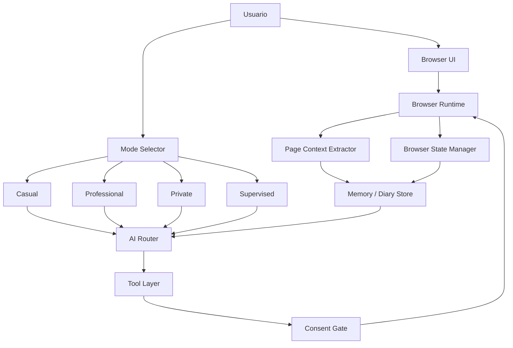

# MC Browser v2.1 — Navegador con IA Supervisada

Navegador de escritorio basado en Electron con **IA integrada bajo supervisión del usuario**, **memoria local tipo diario** y **modos de uso adaptativos**.

---

## Principios de diseño

- **IA bajo demanda**: no analiza el navegador en segundo plano
- **Privacidad por defecto**: todo se guarda localmente, sin nube
- **Supervisión del usuario**: acciones sensibles requieren confirmación
- **Ligero**: pensado para PCs de bajos recursos
- **Memoria local**: diario semántico, no historial basura
- **Modos de uso**: cada modo adapta el comportamiento de la IA

---

## Modos de conversación

| Modo | Descripción |
|------|-------------|
| **Casual** | Resúmenes rápidos, notas y recordatorios simples |
| **Profesional** | Investigación profunda, análisis y comparación de fuentes |
| **Privado** | Máxima privacidad, sin análisis continuo, sin ejecución automática |
| **Supervisado** | Requiere confirmación explícita para cada acción sensible |

---

## Funcionalidades

### Memoria local (Diario)
- Guardar resúmenes de páginas
- Guardar notas personales
- Crear recordatorios
- Buscar por texto y tags
- Todo persiste en archivos JSON locales

### Permisos y consentimiento
- Acciones de guardado requieren aprobación en modo supervisado
- Cada acción tiene un nivel de permiso definido
- El usuario tiene control total sobre qué se guarda

### Extracción de contexto
- Toma el contenido principal de la página activa
- Extrae título, resumen, keywords y metadata
- Genera un resumen mínimo para la memoria local

### Herramientas del navegador
- Historial persistente en el perfil de la aplicación, con hasta 2.000 entradas
- Modo Reader para extraer y leer el contenido principal de la página activa
- Proxy HTTP, HTTPS o SOCKS5 configurable por sesión
- Idioma y política Referer aplicados a las requests; User-Agent nativo de Chromium para máxima compatibilidad
- Cookies de solo sesión, con excepciones por dominio permitido
- Marcadores, descargas, DoH, detección de streams y soporte opcional de yt-dlp
- Descargas con control completo: pausar, reanudar, cancelar y reintentar desde el panel de descargas
- Los archivos directos se descargan por streaming y se reanudan con `Range` cuando el servidor lo permite
- Los paneles laterales (Marcadores, Recursos, Historial/Descargas y sidebar) admiten fondo independiente con imagen o URL
- Auto-contraste de texto: el color de las letras se adapta a la luminosidad del fondo del panel para mantener la legibilidad
- Menú contextual con extracción de imágenes, enlaces, video, audio y fuentes directas
- Resultados del extractor con filtros, copia de URL y apertura en nueva pestaña
- Panel lateral compartido de Streams y extracción, accesible desde el botón inferior del navegador
- Búsqueda en vivo dentro de listas largas de recursos
- Preview flotante al pasar el cursor sobre una imagen, video o URL extraída
- La fecha `exp` se muestra como señal del enlace; “Fecha indicada pasada” no significa necesariamente que el servidor haya invalidado el stream
- Stream Hunter asociado a la pestaña activa, incluyendo fuentes DOM, requests de red, `fetch`, XHR, `performance` y reproductores comunes

### Compatibilidad de sitios
- **Google**: usa la identidad nativa de Electron/Chromium tanto en el navegador principal como en el mini-navegador del panel de Perchance.
- **Perchance**: el mini-navegador usa Chrome 140 únicamente para Perchance, aislado de las demás sesiones.
- **WhatsApp Web**: aplica compatibilidad únicamente al navegar a `whatsapp.com` o `whatsapp.net`.
- La compatibilidad de WhatsApp se configura en el `webContents` de esa navegación (`did-start-navigation` + `setUserAgent(UA_WHATSAPP)`); no modifica Google ni otras pestañas.
- `UA_WHATSAPP` = Chrome 140 (WhatsApp rechaza versiones antiguas); los Client Hints (`sec-ch-ua`) se alinean solo para dominios WhatsApp.
- La rotación de User-Agent está desactivada de forma permanente mientras se investiga una implementación fiable.

#### Procedimiento de prueba
1. Reiniciar completamente MC Browser para liberar el perfil persistente.
2. Abrir Google en una pestaña nueva y comprobar búsqueda e inicio de sesión.
3. Abrir `https://web.whatsapp.com` en otra pestaña nueva y comprobar carga, sesión y chats.
4. Si una sesión anterior quedó inválida, borrar las cookies del sitio y volver a iniciar sesión.

---

## Estructura del proyecto

```
mc-browser-v2.1/
├── main.js                 ← Proceso principal, red, historial y descargas
├── preload.js              ← Bridge seguro (contextBridge e IPC whitelist)
├── package.json            ← Scripts y versión de Electron
├── modules/
│   ├── adblocker/          ← Motor y listas de bloqueo
│   ├── ai-assistant/       ← Backend y UI del asistente IA
│   └── stream-enhancer/    ← Detección de streams
├── preload/                ← Parches de login y chat web
├── src/renderer.html       ← UI y lógica principal del renderer
└── mcb-v3/                 ← Prototipo separado en Python
```

---

## Instalación

### Requisitos
- Node.js 18+

### Ejecutar

```bash
cd mc-browser-v2.1
npm install
npm start
```

---

## Arquitectura



---

## Licencia

GPL-3.0
